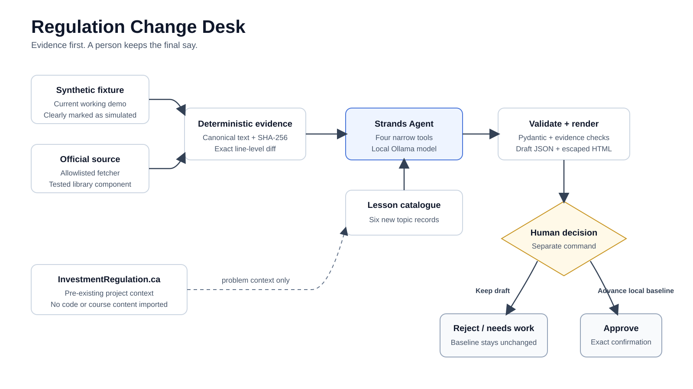

# Regulation Change Desk

A local Strands agent that helps a course maintainer review changes in Canadian investment-regulation sources. It prepares a traceable review packet and leaves every baseline unchanged until a person explicitly approves it.

This is an early hackathon prototype. It does not update InvestmentRegulation.ca, provide legal advice, or automate CIRO retrieval. The working demonstration uses fictional text and is visibly labelled `SIMULATION ONLY`.

## What works now

- deterministic canonicalization, SHA-256 evidence, and line-level diffing;
- exact host/path allowlisting for future official-source fetches;
- a fictional before/after demonstration with no personal or course data;
- one Strands `Agent` using four narrow, in-memory tools and Ollama;
- Pydantic validation followed by stricter evidence and lesson-ID checks;
- a separate human-decision command; rejection cannot advance a baseline;
- a local HTML review page with escaped source text;
- dependency-free unit tests for the safety-critical core.

## Local setup

Python 3.10 or newer and Ollama are required.

```sh
python3 -m venv .venv
.venv/bin/python -m pip install --upgrade pip
.venv/bin/python -m pip install -e .
ollama pull gpt-oss:20b
ollama serve
```

The tested default model is `gpt-oss:20b`. Check model availability and tool support on each machine:

```sh
.venv/bin/reg-change-desk doctor --model gpt-oss:20b
```

Prepare deterministic evidence without an LLM:

```sh
.venv/bin/reg-change-desk prepare-fixture
```

Run the actual Strands tool loop:

```sh
.venv/bin/reg-change-desk review-fixture --model gpt-oss:20b
```

The command prints paths to a JSON packet and a local HTML review page. It never changes a baseline. A separate human may reject it:

```sh
.venv/bin/reg-change-desk decide PACKET_ID --decision reject
```

Approval deliberately needs an explicit phrase:

```sh
.venv/bin/reg-change-desk decide PACKET_ID --decision approve --confirm APPROVE_BASELINE
```

All runtime artifacts stay under ignored `state/`. No command writes to the existing course repository.

## How the working demo flows

1. The fixture command loads two clearly fictional versions of a simulated rule.
2. Deterministic code normalizes the text, hashes both versions, and records the exact changed lines.
3. The Strands agent reads that fixed evidence, searches a small lesson-topic catalogue, records supported impacts, and finalizes an in-memory assessment.
4. Pydantic and deterministic checks reject unknown lesson IDs or excerpts that do not exactly match the diff.
5. The program writes a draft JSON packet and escaped local HTML review page.
6. A separate command records `reject`, `needs-work`, or `approve`. Approval requires the exact phrase `APPROVE_BASELINE` before the local baseline can advance.

The original draft packet and HTML page are retained as review evidence. Decisions are saved separately; the diagram's "Keep draft" branch means retaining that evidence while leaving the baseline unchanged, not leaving the review undecided.



## Tests

```sh
PYTHONPATH=src python3 -m unittest discover -s tests -v
```

Thirty-six deterministic tests cover unchanged and formatting-only input, complete changed evidence, prompt-like source text, path traversal, redirects checked before contact, size limits, invented citations, unknown lesson IDs, HTML escaping, and the decision gate. Decisions cannot be overwritten through a second command. Approval verifies the candidate against the reviewed source and fingerprints, and rejects a changed baseline or a legacy packet that needs a new review.

An optional local-model smoke test exercises the real Strands tool loop:

```sh
RUN_OLLAMA_SMOKE=1 .venv/bin/python -m unittest tests/test_agent_smoke.py -v
```

## Boundaries

- The model cannot choose a source URL or a filesystem path.
- Only manifest-listed HTTPS hosts and paths can be fetched; redirect targets are checked again.
- Changes exceeding24 added/removed lines, a280-character changed line or heading, or a12,000-character diff are rejected for manual review. Evidence is not silently truncated.
- Source text is treated as evidence, never as instructions.
- The model receives no filesystem, network, publishing, or baseline-changing tool. Packet and baseline writes happen outside the agent loop and only after deterministic validation.
- CIRO pages are excluded because CIRO's current website terms restrict automated scraping, indexing, cataloguing, reproduction, and most deep links without written permission.
- Live-source retrieval exists as a tested library component but is not yet exposed as a scheduled or bulk crawler.

## Pre-existing work and development assistance

Daniel Sultan's InvestmentRegulation.ca course existed before this hackathon and inspired the maintenance problem. This repository does not include its code, lesson prose, questions, styles, or screenshots. The six-item lesson-topic catalogue and the simulated legal text were created for this prototype.

Daniel is the sole entrant. Substantial AI assistance was used to develop this prototype and draft its documentation for his course-maintenance use case. The running agent uses the open-source Strands Agents SDK with a local Ollama model; it cannot publish course changes.

## Current limits

- The public demonstration path uses a fictional fixture, so judges can reproduce a substantive change on demand.
- The allowlisted official-source fetcher is tested as a library component but is not connected to a scheduled scan command.
- The project has not run on Amazon Bedrock or AgentCore and should not be described as deployed on AWS.
- This is a local single-reviewer prototype, not a hardened multi-user service. Its per-source lock rejects concurrent decisions; an interrupted write may require manual state recovery. It does not provide a transactional database or defend against an administrator modifying local files.
- CIRO retrieval stays out of scope unless written permission is obtained.

The architecture diagram above distinguishes the working simulation from the separately tested source-fetching library. Source reuse notes are in `NOTICE.md`; dependency licences are in `THIRD_PARTY_NOTICES.md`.
